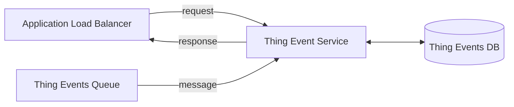

```mermaid
flowchart LR

    ALB[Application Load Balancer] --request---> ThingEventService[Thing Event Service] <---> ThingEventsDB[(Thing Events DB)]
    ThingEventService --response---> ALB
    ThingEventsQueue[Thing Events Queue] --message---> ThingEventService
```
