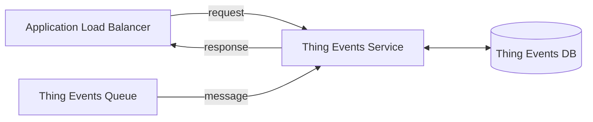

```mermaid
flowchart LR

    ALB[Application Load Balancer] --request---> ThingEventsService[Thing Events Service] <---> ThingEventsDB[(Thing Events DB)]
    ThingEventsService --response---> ALB
    ThingEventsQueue[Thing Events Queue] --message---> ThingEventsService
```
